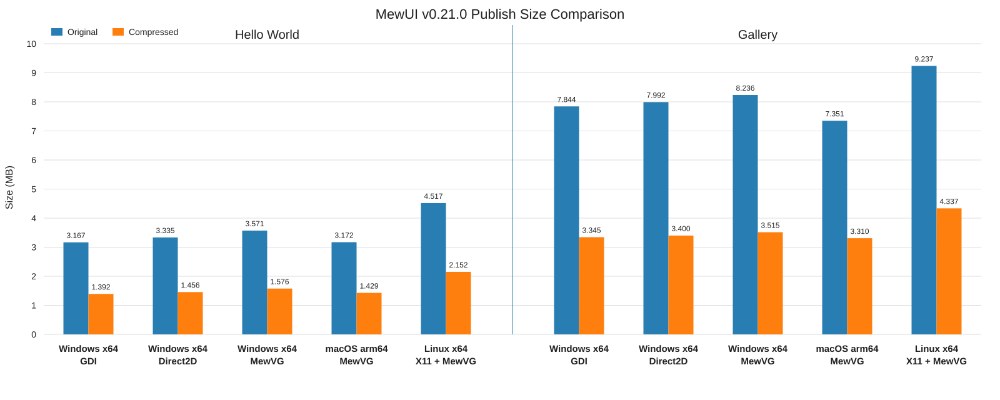
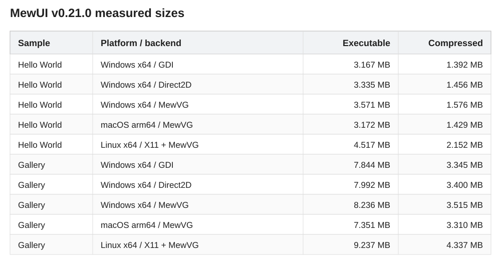

[](https://www.nuget.org/packages/Aprillz.MewUI/)
[](https://www.nuget.org/packages/Aprillz.MewUI/)

---

**😺 MewUI**는 별도 .NET 런타임 설치 없이 배포할 수 있는 **NativeAOT/Trim 친화적** 데스크톱 앱을 만들기 위한 **크로스플랫폼 코드 기반 경량 .NET GUI 프레임워크**입니다.

> [!NOTE]
> MewUI의 공식 발음은 “뮤아이”입니다.

### 프로젝트 상태: 활발한 개발 및 API 안정화 단계
  > [!IMPORTANT]
  > MewUI는 NuGet 패키지, 크로스플랫폼 호스트, 여러 렌더링 백엔드, 선택형 확장 패키지를 갖춘 활발히 개발 중인 프레임워크입니다.
  >
  > 다만 공개 API는 아직 안정화 중이므로 minor 릴리스 사이에도 breaking change가 발생할 수 있습니다. 실제 앱에서는 패키지 버전을 고정하고 업그레이드 전 릴리스 노트를 확인하는 것을 권장합니다.

### 🤖 AI 기반 개발 방식 
  > [!NOTE]
  > 본 프로젝트는 **AI 프롬프팅 중심의 개발 방식**으로 구현되었습니다.  
  > 직접적인 코드 수정 없이 **프롬프트 이터레이션을 통해 설계와 구현을 반복**하였으며,  
  > 각 단계는 개발자가 검토하고 조정하는 방식으로 진행되었습니다.

---

## 🚀 빠르게 실행해 보기

다음 명령어를 Windows 명령 프롬프트 또는 Linux 터미널에서 입력하면 즉시 실행할 수 있습니다.
(.NET 10 SDK가 필요합니다.)
> [!WARNING]
> 이 명령은 GitHub에서 코드를 직접 다운로드하여 실행합니다.
```bash
curl -sL https://raw.githubusercontent.com/aprillz/MewUI/refs/heads/main/samples/FBASample/fba_gallery.cs -o - | dotnet run -
```


### 비디오
[https://github.com/user-attachments/assets/2e0c1e0e-3dcd-4b5a-8480-fa060475249a](https://github.com/user-attachments/assets/fc2d6ad8-3317-4784-a6e5-a00c68e9ed3b)

### 스크린샷

| Light | Dark |
|---|---|
|  |  |

---
## ✨ 주요 특징

- 📦 **NativeAOT + Trim** 우선
- 🪶 **빠르고 가볍게** (가벼운 실행 파일 크기, 낮은 메모리 풋프린트, 빠른 시작)
- 🧩 Fluent **C# 마크업**

---

## 🚀 빠른 시작

- NuGet: https://www.nuget.org/packages/Aprillz.MewUI/
  - `Aprillz.MewUI`는 Core, 전 플랫폼 호스트, 전 렌더링 백엔드를 포함하는 **메타패키지**입니다.
  - 플랫폼별 패키지도 제공됩니다: `Aprillz.MewUI.Windows`, `.Linux`, `.MacOS`
  - 설치: `dotnet add package Aprillz.MewUI`
  - 참고: [설치 및 패키지 구성](docs/Installation.ko.md)

- File-Based App(FBA)으로 빠르게 시작 (VS Code 친화, .NET 10+)
  - 참고: `samples/FBASample/fba_calculator.cs`
  - AOT/Trim 옵션을 제외한 최소 헤더:

    ```csharp
    #:sdk Microsoft.NET.Sdk
    #:property OutputType=Exe
    #:property TargetFramework=net10.0

    #:package Aprillz.MewUI@0.19.1

    //...
    ```

- 실행: `dotnet run your_app.cs`

---
## 🧪 C# 마크업 예시

- 샘플 소스: https://github.com/aprillz/MewUI/blob/main/samples/MewUI.Sample/Program.cs
    ```csharp
    var window = new Window()
        .Title("Hello MewUI")
        .Resizable(520, 360)
        .Padding(12)
        .Content(
            new StackPanel()
                .Spacing(8)
                .Children(
                    new Label()
                        .Text("Hello, Aprillz.MewUI")
                        .FontSize(18)
                        .Bold(),
                    new Button()
                        .Content("Exit")
                        .OnClick(Application.Shutdown)
                )
        );

    Application.Run(window);
    ```

---
## 🎯 컨셉

MewUI는 작고 명시적인 코어 위에 플랫폼 호스트와 렌더링 백엔드를 분리해 쌓는 코드 기반 GUI 프레임워크입니다.

- **NativeAOT + Trim 친화**
- 작은 크기, 빠른 시작시간, 적은 메모리 사용
- **XAML 없이 Fluent한 C# 마크업**으로 UI 트리 구성
- **AOT 친화적인 명시적 바인딩** (중첩 경로 지원)
- 코어는 얇게 유지하고 큰 기능은 선택형 확장 패키지로 분리

### 지향하지 않는 것
- XAML/WPF 완전 호환
- WPF나 Avalonia와 동일한 API/동작을 제공하는 대체품
- 디자이너 중심 개발 워크플로우
- 리플렉션 기반 경로 바인딩
- 모든 것을 담은 만능 컨트롤 카탈로그

코어는 일반적인 데스크톱 UI 패턴까지 담고, 차트나 도킹 같은 특화 기능은 확장 패키지로 제공합니다.

---
## ✂️ NativeAOT / Trim

- 기본적으로 trimming-safe를 지향합니다(명시적 코드 경로, 리플렉션 기반 바인딩 없음).
- Windows 상호운용은 NativeAOT 호환을 위해 소스 생성 P/Invoke(`LibraryImport`)를 사용합니다.
- Linux에서 NativeAOT로 빌드하려면, 일반 .NET SDK 외에 AOT 워크로드가 필요합니다(예: 배포판 패키지로 `dotnet-sdk-aot-10.0` 설치).
- 새로운 상호운용 코드나 동적 기능을 추가했다면, 위 publish 설정으로 반드시 검증하는 것을 권장합니다.

로컬에서 확인:
- Publish: `dotnet publish .\samples\MewUI.Gallery\MewUI.Gallery.csproj -c Release -p:PublishProfile=win-x64-trimmed`
- 출력 확인: `.artifacts\publish\MewUI.Gallery\win-x64-trimmed\`

NativeAOT 실행 파일 크기는 플랫폼 호스트, 렌더링 백엔드, 리소스, publish 옵션에 따라 달라집니다. 아래 표는 **main executable만** 측정한 값이며, ZIP은 같은 실행 파일을 기본 측정 설정으로 압축한 보조값입니다. 크기는 **1 MB = 1024 KB** 기준입니다.

재현 가능한 크기 probe, 회귀 예산, NativeAOT map 분석 방법은 [NativeAOT 크기 도구](tools/aot-size/README.md)를 참고하세요.





[측정 데이터](tools/aot-size/release-sizes.json)

Gallery는 full-featured showcase 샘플입니다. 최소 배포 크기의 기준은 Hello World 행을 참고하세요.

---
## 🔗 상태/바인딩(AOT 친화)

바인딩은 리플렉션 없이, 명시적/델리게이트 기반입니다. 소스는 세 가지를 지원합니다. `ObservableValue<T>`, `INotifyPropertyChanged`를 구현한 뷰모델, 다른 요소의 `MewProperty<T>`입니다. 한 경로 안에 섞어 쓸 수 있고, `INotifyCollectionChanged` 알림도 받습니다.

```csharp
var percent = new ObservableValue<double>(
    initialValue: 0.25,
    coerce: v => Math.Clamp(v, 0, 1));

var slider = new Slider()
                .BindValue(percent);

var label  = new Label()
                .BindText(
                    percent, 
                    convert: v => $"Percent ({v:P0})"); 
```

**INotifyPropertyChanged** - 평범한 MVVM 뷰모델을 감싸지 않고 그대로 씁니다. 구독은 약한 참조로 걸리므로 뷰모델 때문에 화면 객체가 메모리에 남지 않습니다.

```csharp
new Label().Bind(Label.TextProperty, vm, x => x.UserName);

// TextBox는 기본이 양방향이라 입력한 값이 뷰모델에 반영됩니다
new TextBox().Bind(TextBox.TextProperty, vm, x => x.UserName);
```

**중첩 경로** - 점으로 이어 쓰면 컴파일 타임에 단계별 세그먼트로 분해됩니다. 문자열도 리플렉션도 없고, 중간 값이 교체되면 그 뒤 단계가 자동으로 다시 연결됩니다.

```csharp
// order.Customer.City
var city = new TextBlock().Bind(TextBlock.TextProperty, order, x => x.Customer.City);

// 인덱서. 0번 항목이 바뀌거나 앞에 항목이 추가/삭제되면 함께 갱신됩니다
var first = new TextBlock().Bind(TextBlock.TextProperty, order, x => x.Lines[0].ProductName);
```

단계마다 멤버의 타입을 보고 관찰 방식을 고릅니다. `INotifyPropertyChanged`면 `PropertyChanged`, `ObservableValue<T>`면 그 알림, `MewObject`면 대응하는 `MewProperty`, 통지하는 컬렉션이면 `CollectionChanged`입니다.

이 한 줄 문법은 .NET 9 이상 SDK로 빌드할 때 동작합니다. 그 아래에서는 같은 경로를 `BindingPath`와 `ThenNotifying`으로 명시해 쓰며, 잃는 것은 문법이지 기능이 아닙니다.

세그먼트 종류, null/fallback, TwoWay, 컬렉션, 수명 규칙은 [Binding](docs/Binding.ko.md) 문서를 참고하세요.

---
## 🧱 컨트롤 / 패널

컨트롤(구현됨):
- `Button`, `ToggleButton`, `RepeatButton`, `SplitButton`, `DropDownButton`
- `Label`, `TextBlock`, `Image`
- `TextBox`, `MultiLineTextBox`, `SyntaxViewer`, `PasswordBox`
- `CheckBox`, `RadioButton`, `ToggleSwitch`
- `ComboBox`, `ListBox`, `TreeView`, `GridView`
- `Slider`, `ProgressBar`, `ProgressRing`, `NumericUpDown`
- `TabControl`, `GroupBox`, `Expander`, `Border`
- `ColorPicker`, `DatePicker`, `Calendar`
- `MenuBar`, `ContextMenu`, `ToolTip` (창 내 팝업)
- `ToolBar` (선언한 밴드에 명령 그룹, 그립으로 끌어 재배치)
- `NavigationView`
- `ScrollViewer`
- `Window`, `DispatcherTimer`

패널:
- `Grid` (row/column: `Auto`, `*`, 픽셀)
- `StackPanel` (가로/세로)
- `DockPanel` (도킹 + 마지막 채우기)
- `UniformGrid` (균등 셀)
- `WrapPanel` (줄바꿈 + Item size)
- `Canvas` (절대 위치)
- `SplitPanel` (드래그 분할)

> `Canvas`(절대 위치)와 `SplitPanel`을 제외한 모든 패널은 `Spacing`을 지원합니다.

---
## 🧩 확장 (Extensions)

코어 위에 선택적으로 얹는 패키지입니다. 필요한 것만 참조하세요.

| 확장 | 설명 | 패키지 |
|------|------|--------|
| [**MewDock**](extensions/MewUI.MewDock/README.ko.md) | Visual Studio 스타일 도킹 - 문서/툴 탭, 드래그 재배치, 분할, 자동 숨김, 최대화, 팝아웃 | `Aprillz.MewUI.MewDock` |
| [**SVG**](extensions/MewUI.Svg/README.ko.md) | 순수 C# SVG 파싱/렌더링 (System.Drawing 비의존, AOT 호환) | `Aprillz.MewUI.Svg` |
| [**Skia**](extensions/MewUI.Skia/README.ko.md) | `SkiaCanvasView` (SkiaSharp로 그리기) + GPU zero-copy 인터롭 | `Aprillz.MewUI.Skia` |
| [**MewCharts**](extensions/MewUI.MewCharts/README.ko.md) | LiveChartsCore 엔진 기반 차트 (Cartesian/Pie/Polar), SkiaSharp 비의존 | `Aprillz.MewUI.MewCharts` |
| [**WebView2**](extensions/MewUI.WebView2.Win32/README.md) | Win32 WebView2 컨트롤 (Microsoft Edge WebView2 런타임 필요, Windows 전용) | `Aprillz.MewUI.WebView2.Win32` |

**Skia 인터롭** - 사용 중인 백엔드에 맞는 zero-copy 브리지를 하나 추가하면 GPU 직행 경로가 켜집니다.

| 백엔드 | 패키지 |
|--------|--------|
| Direct2D | `Aprillz.MewUI.Skia.Interop.Direct2D` |
| GDI | `Aprillz.MewUI.Skia.Interop.Gdi` |
| MewVG / Win32 | `Aprillz.MewUI.Skia.Interop.MewVG.Win32` |
| MewVG / X11 | `Aprillz.MewUI.Skia.Interop.MewVG.X11` |
| MewVG / macOS | `Aprillz.MewUI.Skia.Interop.MewVG.MacOS` |

> 인터롭 없이도 Skia 콘텐츠는 CPU 업로드 폴백으로 렌더링됩니다. Skia는 메타패키지 `Aprillz.MewUI.Skia.Windows` / `.Linux` / `.MacOS` / `.All`로도 묶여 있습니다.

> **MewDock**은 [FlexLayout](https://github.com/caplin/FlexLayout)(MIT)의 C# 포팅입니다. 라이선스 고지는 `THIRD_PARTY_NOTICES.md` 참고.

---
## 🎨 테마(Theme)
MewUI는 `Theme` 객체(색상 + 메트릭)와 `ThemeManager`를 사용하여 기본값 설정과 런타임 변경을 제어합니다.

- `ThemeManager.Default*`를 통해 `Application.Run(...)` 이전에 기본값을 설정합니다.
- `Application.Current.SetTheme(...)` /
  `Application.Current.SetAccent(...)`를 통해 런타임에 변경할 수 있습니다.

참고: `docs/Theme.md`

---
## 🖌️ 렌더링 백엔드

렌더링은 다음 인터페이스를 통해 추상화되어 있습니다.
- `IGraphicsFactory` / `IGraphicsContext`

백엔드:

| 백엔드 | 플랫폼 | 패키지 |
|--------|--------|--------|
| **Direct2D** | Windows | `Aprillz.MewUI.Backend.Direct2D` |
| **GDI** | Windows | `Aprillz.MewUI.Backend.Gdi` |
| **MewVG** | Windows | `Aprillz.MewUI.Backend.MewVG.Win32` |
| **MewVG** | Linux/X11 | `Aprillz.MewUI.Backend.MewVG.X11` |
| **MewVG** | macOS | `Aprillz.MewUI.Backend.MewVG.MacOS` |

> **[MewVG](https://github.com/aprillz/MewVG)**는 [NanoVG](https://github.com/memononen/nanovg)의 Managed 포트로, Windows/Linux에서는 OpenGL, macOS에서는 Metal을 사용합니다.

백엔드는 참조된 백엔드 패키지에 의해 등록됩니다 (Trim/AOT 친화적 구조).

애플리케이션 코드에서는 일반적으로 다음 중 하나를 사용합니다.
- `Application.Run(...)` 이전에 `*Backend.Register()`를 호출하거나
- 빌더 체인 방식인 `Application.Create().Use...().Run(...)`을 사용합니다.

메타패키지 사용 시 publish 단계에서 `-p:MewUIBackend=Direct2D`로 백엔드를 선택할 수 있습니다. 상세는 [설치 및 패키지 구성](docs/Installation.ko.md)을 참고하세요.

---
## 🪟 플랫폼 추상화

윈도우 관리와 메시지 루프는 플랫폼 계층 뒤에서 추상화되어 있습니다.

현재 구현된 플랫폼:
- Windows (`Aprillz.MewUI.Platform.Win32`)
- Linux/X11 (`Aprillz.MewUI.Platform.X11`)
- macOS (`Aprillz.MewUI.Platform.MacOS`)

### 대화상자 통합

프롬프트와 파일/폴더 서비스는 플랫폼 추상화 계층을 통해 라우팅됩니다. 관리형 MewUI `MessageBox`는 동기 및 비동기 방식을 모두 지원하며 크로스플랫폼 프롬프트의 권장 선택입니다. `NativeMessageBox`는 OS가 제공하는 프롬프트가 특별히 필요한 경우를 위한 선택 사항이며 네이티브 통합을 사용할 수 없으면 관리형으로 폴백합니다.

MewUI는 크로스플랫폼 관리형 파일 및 폴더 대화상자를 제공합니다. 파일 및 폴더 대화상자는 기본적으로 네이티브 통합을 우선 사용하며(`PreferNative = true`), 사용할 수 없거나 실패하면 관리형으로 폴백합니다.

- Windows는 Win32 파일/폴더 대화상자를 사용합니다.
- macOS는 AppKit 파일/폴더 대화상자를 사용합니다.
- Linux/X11은 XDG Desktop Portal을 사용합니다. Portal이 없거나 실패하면 관리형 대화상자로 폴백합니다.

관리형 대화상자를 바로 사용하려면 `PreferNative`를 `false`로 설정합니다.

---
## 📄 문서

- [설치 및 패키지 구성](docs/Installation.ko.md)
- [C# Markup](docs/CSharpMarkup.ko.md)
- [Command System](docs/CommandSystem.ko.md)
- [Binding](docs/Binding.ko.md)
- [Items and Templates](docs/ItemsAndTemplates.ko.md)
- [Theme](docs/Theme.ko.md)
- [Application Lifecycle](docs/ApplicationLifecycle.ko.md)
- [Layout](docs/Layout.ko.md)
- [Window 시각 레이어](docs/WindowLayers.ko.md)
- [RenderLoop](docs/RenderLoop.ko.md)
- [Hot Reload](docs/HotReload.ko.md)
- [에디터 프리뷰](docs/Preview.ko.md)
- [Custom Controls](docs/CustomControls.ko.md)
- [Control Template](docs/ControlTemplate.ko.md)
- [텍스트 뷰 확장](docs/TextViewExtensions.ko.md)
- [Localization](docs/Localization.ko.md)

---
## 🤝 커뮤니티

- [Contributing](CONTRIBUTING.ko.md)
- [Code of Conduct](CODE_OF_CONDUCT.ko.md)

---
## 🧭 로드맵

**플랫폼**
- [ ] Linux/Wayland
- [ ] Linux 프레임버퍼

**툴링**
- [x] Hot Reload (실험적)
- [ ] 디자인 타임 미리보기

---
## 라이선스

MewUI는 [MIT 라이선스](LICENSE)에 따라 배포됩니다.

서드파티 소프트웨어 고지는
[THIRD_PARTY_NOTICES.md](THIRD_PARTY_NOTICES.md)에서 확인할 수 있습니다.
